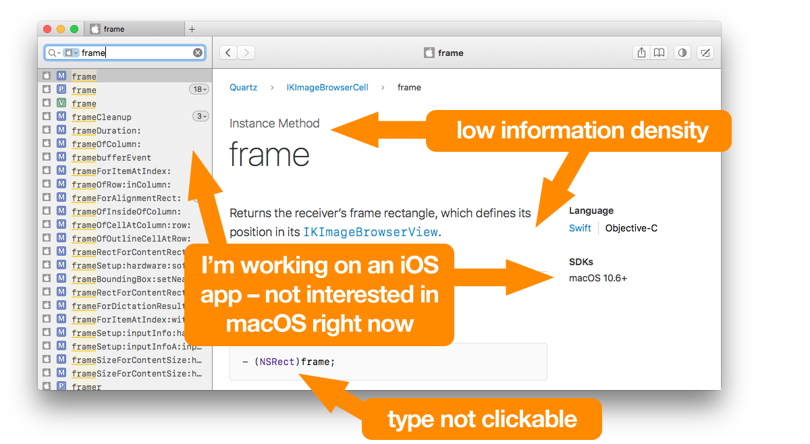
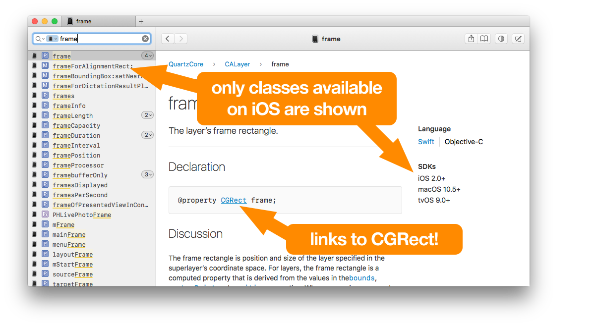
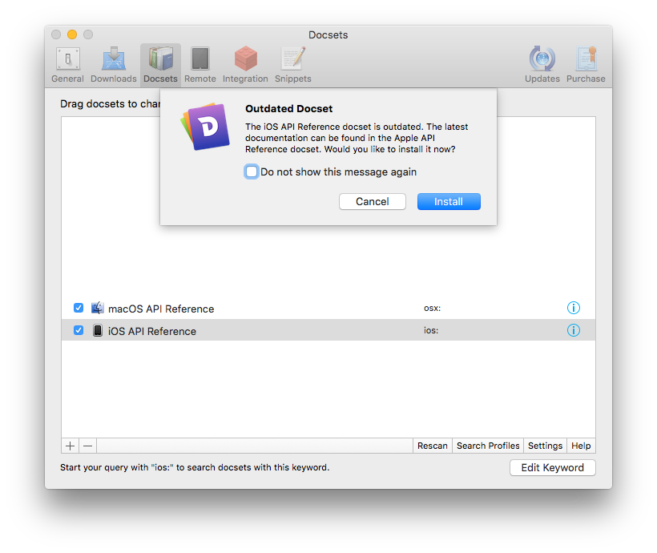

# Hyphen - Improving Apple’s API Reference in Dash

[Dash](https://kapeli.com/dash) supports Apple’s new, unified API reference for macOS, iOS, tvOS and watchOS. However:

* you cannot filter by platform.
* types are not clickable.
* information density suffers from huge headlines and generous whitespace.



Hyphen is a [Ruby script](./hyphen.rb) that extracts a configurable subset of the API reference and tweaks the [CSS](./style_overrides.css) at the same time.



## Quick start

```bash
git clone https://github.com/lurado/hyphen.git && cd hyphen
gem install sqlite3 # or "sudo gem install sqlite3" if you use Apple’s Ruby
./hyphen.rb --language=objc --platform=ios --output=~/Desktop
# this takes a while, let it run in the background...
# double-click the generated ~/Desktop/iOS_API_Reference.docset
```

Run `./hyphen.rb --help` for the full command-line reference.

If you see this warning while adding your docset to Dash, simply ignore it and click _Install_:



## Some details

Hyphen requires the “Apple API Reference” docset to be installed in Dash (latest version).

It will not touch the existing docset, but instead create a new docset by running the following steps:

1. Extract every HTML file from Xcode’s embedded docset.
2. Remove each language from the search index that has not been whitelisted with `--language=objc` or `--language=swift`.
3. Remove each platform that has not been whitelisted with `--platform=...os`, and add hyperlinks to type names at the same time.
4. Append [style_overrides.css](./style_overrides.css) to the styles of the extracted docset.
5. Change the name and keyword of the generated docset in the docset’s Info.plist file.

The best place to start reading and hacking the source code is the method `Hyphen#run(args)`.

## Why does Hyphen remove languages (Objective-C/Swift)?

We have been experiencing a bug in Dash where clicking search results for Objective-C methods would show the Swift reference, so Hyphen supports removing languages from the search index. The language picker (Swift | Objective-C) in the generated docset will still work.

Simply specify `--language=objc --language=swift` if you do not want to remove either language.

## License

Hyphen is released under the [MIT license](LICENSE).
